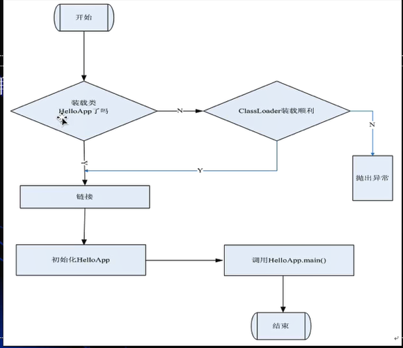

# jvm

#### GC的基础知识

1. 什么是垃圾:
   - c语言申请内存: malloc free
   - c++: new delete
   - java: new
     - 自动内存回收,编程上简单,系统不容易出错,手动释放内存,容易出两类型错误:
       1. 忘记回收
       2. 多次回收
   - which instance are root?
     - jvm stack
     - native method stack
     - run-time
     - constant pool
     - static references in method area
     - Clazz
   
2. 常见的垃圾回收算法:

   - Mark-Sweep(标记清除)
     - 位置不连续,产生碎片
   - Copying(拷贝)
     - 没有碎片,但是浪费空间
   - Mark-Compact(标记压缩)
     - 效率比较低,没有碎片

3. JVM分代算法

   - new - young
     - 存活对象少
     - 使用copy算法,效率高
   - old
     - 垃圾少
     - 一般使用mark compact
     - g1使用copy
   - MethodArea逻辑概念: 永久代(1.7)  元数据(1.8)
     - 方法区是sun公司虚拟机定义的规范。
     - 永久代是方法区的一个实现。
     - 元空间是方法区的一个实现，是永久代的一种替换。
     - jdk1.6及以前stringpool在方法区中，jdk1.7在堆中，
     - jdk1.8在元空间中。jdk1.8元空间维护的是一个StringTable
     - 哈希类，stringpool记录的是引用，实例还是在堆中。
   - 新生代 = eden + 2个suvivor
     1. YGC回收之后,大多数的对象会被回收,活着的进入s0
     2. 再次YGC回收,活着的对象 包括 **eden + s0 -> s1**
     3. 再次YGC,活着的对象 **eden + s1 -> s0**
     4. 年龄足够 -> old
   - 老年代满了
     - FGC Full GC
   - GC Tuning
     1. 尽量减少FGC
     2. MinorGC = YGC
     3. MajorGC = FGC

4. 常见的垃圾回收算法

   1. serial 

      1. 年轻代
      2. 单线程的垃圾回收,串行回收

   2. parnew

      1. 年轻代
      2. 配合cms的并行回收

   3. parallel scavenge

      1. 年轻代
      2. 并行回收

   4. cms

      1. ConcurrentMarkSweep: 并发的,垃圾回收和应用程序同时运行,降低STW的时间(200ms)
      2. 老年代

   5. G1(10ms)

   6. ZGC(1ms pk c++)

   7. Shenandoah

   8. eplison

   9. serial old

   10. parallel old

       1.8默认的垃圾回收: PS + Parallel

#### class文件格式

1. java从编码到执行的过程:

   

   

2. jvm和java无关:

   

   

3. jvm是一种规范

#### JDK JRE JVM

​		

#### class file format

- 二进制字节流
- 数据类型: u1 u2 u4 u8 和 _info(表类型)
  - _info的来源是hotspot源码中的写法
- 可以观察ByteCode的方法:
  - javap
  - JBE - 可以直接改
  - JClassLib - IDEA的插件
- 

```java
package com.mfq.jvm.bytecode;

public class T0100_ByteCode01 {
	

}

/**
cafe babe 0000 0031 0010 0700 0201 0025
636f 6d2f 6d66 712f 6a76 6d2f 6279 7465
636f 6465 2f54 3031 3030 5f42 7974 6543
6f64 6530 3107 0004 0100 106a 6176 612f
6c61 6e67 2f4f 626a 6563 7401 0006 3c69
6e69 743e 0100 0328 2956 0100 0443 6f64
650a 0003 0009 0c00 0500 0601 000f 4c69
6e65 4e75 6d62 6572 5461 626c 6501 0012
4c6f 6361 6c56 6172 6961 626c 6554 6162
6c65 0100 0474 6869 7301 0027 4c63 6f6d
2f6d 6671 2f6a 766d 2f62 7974 6563 6f64
652f 5430 3130 305f 4279 7465 436f 6465
3031 3b01 000a 536f 7572 6365 4669 6c65
0100 1554 3031 3030 5f42 7974 6543 6f64
6530 312e 6a61 7661 0021 0001 0003 0000
0000 0001 0001 0005 0006 0001 0007 0000
002f 0001 0001 0000 0005 2ab7 0008 b100
0000 0200 0a00 0000 0600 0100 0000 0300
0b00 0000 0c00 0100 0000 0500 0c00 0d00
0000 0100 0e00 0000 0200 0f
*/

```

​		

#### jvm工具使用

- jconsole
- jvisualvm

#### 类加载机制

- 在java代码中,类型的加载,连接与初始化工程都是在程序运行期间完成的

  - 加载: 从磁盘到内存的时候完成(查找并加载类的二进制数据)

  - 连接: 

    - 验证: 确保被加载的类的正确性

    - 准备: 为类的静态变量分配内存,并将其初始化为默认值

      ```java
      class Test {
      	public static int a = 1
      }
      // 上面代码中在连接在准备阶段 a = 0
      ```

    - 解析: 把类中的符号引用转换为直接引用

      - 符号引用: 和内存没有多大关系
      - 直接引用: 直接指向内存

  - 初始化:  为类的静态变量赋值为正确的初始值 

- 提供了更大的灵活性,增加了更多的可能性

- java虚拟机与程序的生命周期

  - 执行了System.exit()方法
  - 程序正常执行结束
  - 程序在执行过程中遇到了异常或者错误而异常终止
  - 由于操作系统错误而导致java虚拟机进程终止

  

  

#### 类的加载,连接与初始化

- java程序对类的使用方式可分为两种
  - 主动使用:
  - 被动使用
- 所有的java虚拟机实现必须在每个类或接口被java程序首次主动使用时才初始化他们

主动使用:(七种)

- 创建类的实例
- 访问某个类或接口的静态变量,或者对改静态变量赋值
- 调用类的静态方法
- 反射
- 初始化一个类的子类
- java虚拟机启动时被标明为启动类的类
- jdk1.7开始提供的动态语言支持
- 除了上面七种情况,其他使用java类都不是主动使用,不会初始化
- 类的加载指的是将类的.class分拣中的二进制数据读入到内存中,将其放在运行时数据区的方法区中,然后在内存中创建一个java.lang.Class对象用来封装类在方法区内的数据结构 

#### 类的加载

- 加载.class文件的方式
  - 从本地系统中直接加载
  
  - 通过网络下载.class文件
  
  - 从zip.jar等归档文件中加载.class文件
  
  - 从数据库中提取.class文件
  
  - 将java源文件动态编译为.class文件
  
    
  
    

- 类的加载的最终产品是位于内存中的Class对象
- Class对象封装了类在方法区内的数据结构,并且向java程序员提供了访问方法区内的数据结构的接口
- 有两种类型的类加载器
  - java虚拟机自带的加载器
    - 根类加载器(Bootstrap)
    - 扩展类加载器(Extension)
    - 系统类加载器(SYstem)
  - 用户自定义的类加载器
    - java.lang.ClassLoader的子类
    - 用户可以定制类的加载方式

#### 类的验证

- 类的验证的内容
  - 类文件的结构检查
  - 语义检查
  - 字节码检查
  - 而精致兼容性的验证

#### 类的准备

在准备阶段java虚拟机为类的静态变量分配内存,并设置默认的初始值

#### 类的初始化

在初始化阶段,java虚拟机执行类的初始化语句,为类的静态变量赋予初始值,静态变量的声明语句,以及静态代码块都被看作类的初始化语句,java虚拟机会按照初始化语句在类文件中的先后顺序来依次执行他们.

#### 类的初始化步骤

- 假如这个类还没有被加载和连接,那么就先进行加载和连接
- 假如类存在直接父类,并且这个父类还没有被初始化,那么久先初始化直接父类
- 假如类中存在初始化语句,那么就一次执行这些初始化语句

#### 类加载器


####  类的初始化时机

当java虚拟机初始化一个类时,要求他的所有父类都已经被初始化,但是这条规则并不适用于接口

- 在初始化一个类时,并不会先初始化他的父接口
- 在初始化一个接口时,并不会先初始化他的父接口

因此,一个父接口并不会因为他的子接口或者实现类的初始化而初始化.只有当程序首次使用特定接口的静态变量时,才会导致该接口的初始化

#### 类加载器的双亲委托机制


#### 类加载机制的父亲委托机制


#### 命名空间

- 每个类的加载器都有自己的命名空间,命名空间由该加载器以及所有父加载器所加载额类组成
- 在同一个命名空间中,不会出现类的完整名字(包括类的包名)相同的两个类
- 在不同的命名空间中,有可能会出现类的完整名字(包括类的包名)相同的两个类

#### 关于java字节码

- 使用javap -verbose命令分析一个字节码文件时,将会分析改字节码的魔数, 版本号,常量池,类信息,.类的构造方法,类中的方法信息,类变量与成员变量等信息.
- 魔数: 所有的.class字节码文件的前四个字节都是魔数,魔数为固定值:0xCAFEBABE.
- 魔数之后的四个字节为版本信息,前两个字节便是minor version(此版本号), 后两个字节表示major version(主版本号)
- 常量池(constant pool): 紧接着主版本号之后的就是常量池的入口.一个java类 定义的很多信息都是由常量池来维护和描述的. 可以将常量池看作是class文件的资源仓库,比如java类中定义的方法与变量信息,都是存储在常量池中.常量池中主要存储两类常量: 字面量和符号引用.字面量如java字符串, java中声明为final的常量值等,而符号引用如类和接口全局限定名,字段名称和描述符,方法名称和描述符等
- 常量池的总体结构: java类所对应的常量池主要you常量池数量与常量池组两部分组成. 常量池数量紧跟在主版本号后面,占据两个字节;常量池数组紧跟在常量池数量之后.常量池数组与一般数组不同的是,常量池数组中不同的元素的类型,结构都是不同的,长度当然也不同;但是,每一种元素的第一个数据都是一个u1类型,该字节是个标志类,占据一个字节.JVM在解析常量池时,会根据这个u1类型来获取元素的具体类型.值的注意的是,常量池数组中元素的个数 = 常量池数 - 1(其中0暂时不使用).目的是满足某些常量池索引值的数据在特定情况下需要表达[不引用任何一个常量池] 的含义: 根本原因在于,索引为0也是一个常量(保留常量), 只不过它不位于常量表中, 这个常量就对应null值.
- 在JVM规范中,每个变量/字段都有描述信息,描述信息主要的作用是描述字段的数据类型,方法的参数列表(包括数量,类型与顺序)与返回值.根据描述符规则,基本数据类型和代表无返回值的void类型都用一个大写字符表示,对象类型则使用字符L加对象的全限定名称来表示.为了压缩字节码文件的体积,对于基本数据类型,JVM都只使用一个大写字母来表示,如下所示: B - byte, C - char, D - double, F - float, I - int, J - long, S - short, Z - boolean, V - void, L - 对象类型, 如Ljava/lang/String;
- 对于数组来说,每一个维度使用一个前置的[来表示,如int[]被记录为[I,String[][]被记录为[[Ljava/lang/String;
- 用描述符描述方法时,按照先参数列表后返回值的顺序来描述.参数列表按照参数的严格顺序放在一组()之内,如方法: String getRealnamebyIdAndNickname(int id, String name)描述符为:  (I,Ljava/lang/String;) Ljava/lang/String;

#### java字节码结构

- Class字节码中有两种数据类型
  - 字节数量直接量: 这是基本的数据类型. 细分为u1, u2, u3, u4, u8四种, 分别代表连续的一个字节,2个字节,4个字节,8个字节组成的整体数据.
  - 表(数组): 表是由多个基本数据类型或者其他表,按照既定顺序组成的大的数据集合. 表是有结构的,他的结构体现在: 组成表的成分所在的位置和顺序都是已经严格定义好的.

#### Access_Flag访问标志


#### JVM运行时数据区域

- 堆(heap)
  - 堆里存放的是对象的实例
  - 是java虚拟机管理内存中最大的一块
  - GC主要的工作区域,为了高效的GC,会把堆细分更多的子区域
  - 线程共享
- 方法区域
  - 存放了每个Class的结构信息,包括常量池,字段描述,方法描述
  - GC的非主要工作区域  

#### 引用计数算法(Reference Counting)

- 给对象添加一个引用计数器,当有一个地方引用它,计数器加1,当引用失效,计数器减1,任何时刻计数器为0的对象就是不可能在被使用的.
- 引用计数算法无法解决对象循环引用的问题 

#### 根搜索算法(GC Roots Tracing)

- 在实际的生产语言中(java C#等),都是使用根搜索算法判定对象是否存活
- 算法的基本思路就是通过一系列的称为"GCRoots"的点作为一个其实进行向下搜索,当一个对象到GC Roots没有任何引用链(Reference Chain)项链,则证明此对象是不可用的
- 在Java语言中, GC Roots包括
  - 在VM栈(帧中的本地变量)中的引用
  - 方法区中的静态引用
  - JNI(即一般说的Native方法)中的引用 

#### JVM常见GC算法

- 标记-清除算法(Mark-Sweep)
- 标记-整理算法(Mark-Compact)
- 复制算法(Copying)
- 分代算法(Generational)